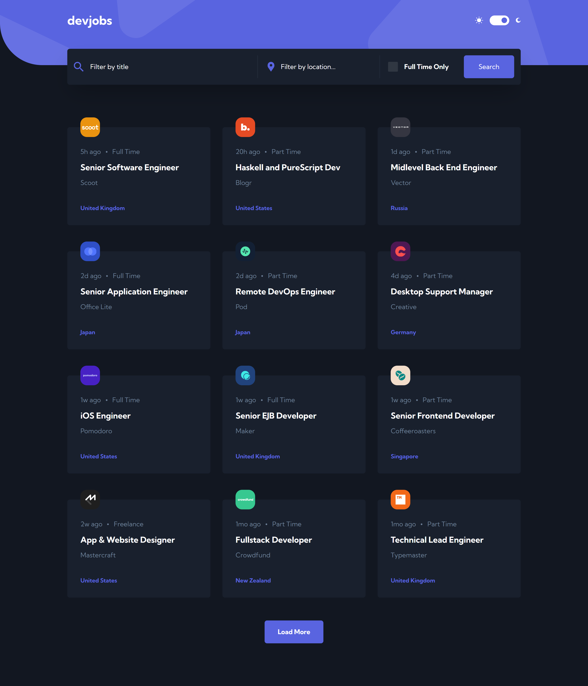

# Frontend Mentor - Devjobs web app solution

This is a solution to the [Devjobs web app challenge on Frontend Mentor](https://www.frontendmentor.io/challenges/devjobs-web-app-HuvC_LP4l). Frontend Mentor challenges help you improve your coding skills by building realistic projects.

## Table of contents

- [Overview](#overview)
  - [The challenge](#the-challenge)
  - [Screenshot](#screenshot)
  - [Links](#links)
- [My process](#my-process)
  - [Built with](#built-with)
  - [What I learned](#what-i-learned)
  - [Continued development](#continued-development)
  - [Useful resources](#useful-resources)
- [Author](#author)

## Overview

### The challenge

Users are be able to:

- View the optimal layout for each page depending on their device's screen size
- See hover states for all interactive elements throughout the site
- Be able to filter jobs on the index page by title, location, and whether a job is for a full-time position
- Be able to click a job from the index page so that they can read more information and apply for the job
- Have the correct color scheme chosen for them based on their computer preferences.

### Screenshot




### Links

# Links to be added

- Solution URL: [Add solution URL here](https://your-solution-url.com)
- Live Site URL: [dev-jobs](https://dev-jobs-4u.netlify.app)

## My process

### Built with

- Semantic HTML5 markup
- Flexbox
- CSS Grid
- Mobile-first workflow
- [TailwindCSS](https://tailwindcss.com) - CSS Utility class based library
- [Vue.js](https://vuejs.org) - JS library
- [Router.vue.js](https://router.vuejs.org) - Router for Vue.js projects
- [Pinia.vue.js](https://pinia.vuejs.org) - State management library for Vue.js


### What I learned

This was my first project using Vue.js and it was fun using it and seeing the differences compared to other Javascript frameworks.

One of the first things I learned about Vue.js was how components were set up using the `composition API`, and how this enables us to setup the logic in a components script tag using the `setup` attribute, which is syntactic sugar for using the composition API. 

Before Vue 3 we would of have to of used a `setup state function` in order to write reactive state and javascript functions, to use them within a component you had to return the state and functions at the end of the setup function. But by using the `setup` attribute you don't need to define all that, as all the code written in the script tag is compiled as the content of the component setup function.

### Example

```js
// Old way
<script>
export default {
  setup() {},
}
</script>

// New Vue 3 way
<script setup>
// ...JS code
</script>
```

I learnt a lot of things about Vue.js by building this project, too many things to cover in this readme, like how the component templates are rendered and their lifecyle.

Although one of the main takeaways from the projects was the basic similarites & differences between Vue and react (The library im most familiar with). 

For example `slots`, which are pretty similar to `children` when wrapping elements inside a component in react and both allow us to easily create re-usable components. Although there are a few differences, for instance with `slots` we can create `named slots` and `default slots` which allows for greater control over how our elements are rendered inside the component. It does this by allowing us to name certain components using the id attribute on the element we're wrapping and then referencing them inside the component using the name attribute, we can then use this to decide how specific elements can be rendered inside of our re-usable component. 

Here's a small example:

```js
// Elements we're passing in by wrapping
<WelcomeItem>
    <template #icon>
      <DocumentationIcon />
    </template>
    <template #heading>Documentation</template>

    <a href="https://vuejs.org/" target="_blank" rel="noopener">official documentation</a>
  </WelcomeItem>

  // WelcomeItem component (Parent component)
<template>
  <div class="item">
    <i>
      {/* Named slot */}
      <slot name="icon"></slot>
    </i>
    <div class="details">
      <h3>
        {/* Named slot */}
        <slot name="heading"></slot>
      </h3>
      {/* Default slot */}
      <slot></slot>
    </div>
  </div>
</template>
```


### Continued development

As this was my first Vue.js project, it took a while for me get used to building with it, as there a few differences from React.js, the framework I'm most used to working with. Although the overall differences were really only a few different behavioral ones and the syntax, the overall concept of the two remained the same (creating components to build the UI).

I look forward to building more projects with Vue.js in the future and with time and more experience, learn much more about it. As well as seeing more of the pros and cons when using it in comparison with other frameworks, which will also help me gain a more comprehensive understanding of building projects with different javascript frameworks. I believe this will be able to help me choose which framework is best for specific projects and their needs going forward. (Will help me choose which tool is best for the job)

I also look forawrd to learning on how handle and work with APIs in Vue, and my next propject I work on with vue will definitly have features that use APIs so I can learn and gain experience using APIs inside of Vue. 

### Useful resources
- [Vue 3 crash course](https://www.youtube.com/@JohnKomarnicki) - Before I started this project I took a two hour crash course on youtube and took notes so I could quickly prepare myself with the basics and get an overall feel of what I was getting into. The course is a great and to the point introduction to Vue 3. The channel is called `John Komarnicki` and this link leads to the vue crash course if you want to check it out, it was very helpful.

- [Vue.js Docs](https://vuejs.org) - This helped me when I needed to look something up about vue, wether that was a certain behaviour or just some syntax I wasn't sure with, their documentation is one of the best I've used and was easy to find what I was looking for.

- [Pinia](https://pinia.vuejs.org) - This was just as helpful as the vue docs. Everything I needed help with was here and it's easy to navigate.


## Author

- Website/Portfolio - [DJHwebdevelopment](https://www.djhwebdevelopment.com)
- Frontend Mentor - [@David-Henery4](https://www.frontendmentor.io/profile/David-Henery4)
- LinkedIn - [David Henery](https://www.linkedin.com/in/david-henery-725458241)


